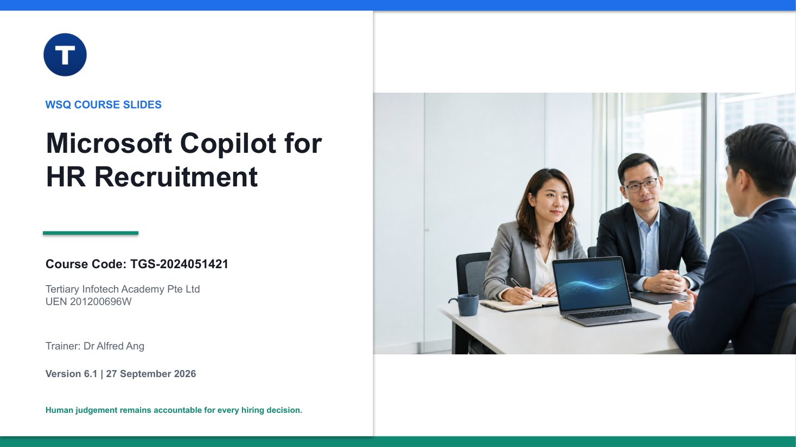

# Microsoft Copilot for HR Recruitment

A hands-on WSQ course on using Microsoft 365 Copilot and Copilot Studio agents for fair, evidence-led candidate
screening, structured interviewing and feedback, with a named human accountable for every hiring decision.

| Course detail | Information |
|---|---|
| Course code | `TGS-2024051421` |
| Programme | WSQ (SkillsFuture Singapore) |
| Duration | 1 day, 8 hours (9:30am-6:30pm) |
| TSC | Interviewing (`RET-PMD-4003-1.1`) |
| Registration | **[View course details and register](https://www.tertiarycourses.com.sg/wsq-microsoft-copilot-for-hr-recruitment.html)** |
| Funding | Up to 90% WSQ course fee funding for eligible Singaporeans/PRs and companies (70-90% by eligibility), valid for classes completed by 28 Nov 2026. Eligibility and terms apply - see the course page. |

## About the course

Learners sign in to a real Microsoft 365 tenant and use Copilot against a synthetic hiring corpus in SharePoint:
they build the interview evidence contract for a role, red-team a screening agent for fairness, privacy and
prompt injection, **build and publish their own Copilot Studio agent**, and run a full AI-assisted hiring round -
screening, structured interview pack, anchored scoring, panel calibration and candidate feedback.

Singapore fair-hiring (TAFEP, Workplace Fairness Act) and PDPA controls run through every activity. AI output is
always a draft for human review, never an autonomous hiring decision.

## Learning outcomes

By the end of the course, learners should be able to:

- **LO1:** Manage interviews in accordance with legal, ethical, socio-cultural considerations and interview objectives.
- **LO2:** Tailor structured interview questions using generative AI to different interview types and roles.
- **LO3:** Provide evidence-based feedback on interview outcomes and areas for improvement.

## Topics covered

1. **Responsible Interview Planning and Preparation with Generative AI** - evidence contracts, fair-hiring and PDPA
   baselines, data minimisation, prompt injection and how Copilot inherits tenant permissions.
2. **Structured and Role-Specific Interview Questions with Generative AI** - question types, the four-part prompt
   pattern (role, context, task, constraints), neutral probes and 1/3/5 behavioural anchors.
3. **Candidate Response Evaluation, Feedback and Hiring Decisions** - separating evidence from inference, anchored
   scoring, panel calibration and respectful, evidence-based candidate feedback.

## Activities

Each folder contains `instruction.pdf`, `checklist.pdf`, a short README and the evidence template(s) for the task.

1. [Sign In to Microsoft 365 Copilot and Set the Ground Rules](activities/activity-01-sign-in-to-microsoft-365-copilot-and-set-the-ground-rules)
2. [Build the Interview Evidence Contract with Copilot](activities/activity-02-build-the-interview-evidence-contract-with-copilot)
3. [Red-Team the Screening Agent: Fairness, Privacy and Prompt Injection](activities/activity-03-red-team-the-screening-agent-fairness-privacy-and-prompt-injection)
4. [Prompt Engineering: The Four-Part Pattern for Interview Questions](activities/activity-04-prompt-engineering-the-four-part-pattern-for-interview-questions)
5. [Generate a Structured Interview Pack with the Question Designer Agent](activities/activity-05-generate-a-structured-interview-pack-with-the-question-designer-agent)
6. [Build Your Own Screening Agent in Copilot Studio](activities/activity-06-build-your-own-screening-agent-in-copilot-studio)
7. [Candidate-Side Practice: Web App, Prep Coach and the STAR Upgrade](activities/activity-07-candidate-side-practice-web-app-prep-coach-and-the-star-upgrade)
8. [Score Evidence and Calibrate the Panel with Copilot](activities/activity-08-score-evidence-and-calibrate-the-panel-with-copilot)
9. [Draft Candidate Feedback with the Feedback Coach](activities/activity-09-draft-candidate-feedback-with-the-feedback-coach)
10. [Capstone: End-to-End AI-Assisted Hiring Round](activities/activity-10-capstone-end-to-end-ai-assisted-hiring-round)

## Courseware package (v6.1)

| Resource | Files | Purpose |
|---|---|---|
| Slide deck | [PPTX](courseware/Microsoft%20Copilot%20for%20HR%20Recruitment-v6.1.pptx) · [PDF](courseware/Microsoft%20Copilot%20for%20HR%20Recruitment-v6.1.pdf) | 284 visual, mechanism-led slides |
| Learner Guide | [DOCX](courseware/LG-Microsoft%20Copilot%20for%20HR%20Recruitment-v6.1.docx) · [PDF](courseware/LG-Microsoft%20Copilot%20for%20HR%20Recruitment-v6.1.pdf) · [Markdown](courseware/LG-Microsoft%20Copilot%20for%20HR%20Recruitment-v6.1.md) | Full procedures, screenshots, troubleshooting and acceptance checks |
| Lesson Plan | [DOCX](courseware/LP-Microsoft%20Copilot%20for%20HR%20Recruitment-v6.1.docx) · [PDF](courseware/LP-Microsoft%20Copilot%20for%20HR%20Recruitment-v6.1.pdf) | One-day schedule mapped to slides and activities |
| Lab Prompt Pack | [PDF](courseware/Lab%20Prompt%20Pack%20-%20Microsoft%20Copilot%20for%20HR%20Recruitment-v6.1.pdf) | Every copy-paste prompt, the live agent links and the SharePoint corpus map |
| Activities | [activities/](activities) | 10 activity folders |

Other folders: [`sharepoint/`](sharepoint) (synthetic corpus - 105 resumes, 15 HR policies, 5 JDs),
[`agents/`](agents) (Copilot Studio agent instructions), [`scripts/`](scripts) (environment and workflow
provisioning) and [`build/`](build) (single-source generator for the whole package).

## Live lab environment

Learners sign in at [Microsoft 365](https://m365.cloud.microsoft/) with a training account.
**The password is given by the trainer in class and is never printed in the courseware.**

Copilot Studio environment: **TGS-2024051421-Generative AI for Interviewing** (the tenant environment keeps its
original name).

| Agent | What it does |
|---|---|
| [Candidate Screener](https://copilotstudio.microsoft.com/environments/80e43c74-22f2-e59c-a56c-f40835547497/agents/fc488ee5-2d14-4a7c-99fc-8bbf049bb748) | Screens resumes against a job description and flags protected data, missing evidence and prompt injection. |
| [Question Designer](https://copilotstudio.microsoft.com/environments/80e43c74-22f2-e59c-a56c-f40835547497/agents/fb88dde0-bd55-4d41-bf50-8415eabd6b05) | Drafts a structured interview pack: competencies, core questions, neutral probes and 1/3/5/N-E anchors. |
| [Evidence Scorer](https://copilotstudio.microsoft.com/environments/80e43c74-22f2-e59c-a56c-f40835547497/agents/1b919e96-4bca-4b24-ac42-4e7c6193f708) | Separates evidence from inference, proposes anchored scores and drives panel calibration. |
| [Feedback Coach](https://copilotstudio.microsoft.com/environments/80e43c74-22f2-e59c-a56c-f40835547497/agents/afc38614-7267-4906-8eeb-f1d0da6aae55) | Drafts respectful, evidence-based candidate feedback with one actionable change. |
| [Interview Prep Coach](https://copilotstudio.microsoft.com/environments/80e43c74-22f2-e59c-a56c-f40835547497/agents/6090a130-cfbc-47f9-b489-e0c4d6389bdd) | Candidate-side practice partner: role questions, STAR rewrites and honest coaching. |

| SharePoint site | Sector |
|---|---|
| [FutureTech Solutions - Careers](https://tertiaryinfotech.sharepoint.com/sites/FutureTech-Careers) | Technology / Data |
| [Harbour Bank - Talent Acquisition](https://tertiaryinfotech.sharepoint.com/sites/HarbourBank-Talent) | Financial Services |
| [MediCare Health - Recruitment](https://tertiaryinfotech.sharepoint.com/sites/MediCare-Recruitment) | Healthcare |
| [GreenLogix Supply Chain - Hiring](https://tertiaryinfotech.sharepoint.com/sites/GreenLogix-Hiring) | Logistics |
| [BrightPath Education - Careers](https://tertiaryinfotech.sharepoint.com/sites/BrightPath-Careers) | Education |

## Assessment and distribution boundary

Assessment: Written Assessment (SAQ, K1-K6) and Role Play (A1-A3), 30 minutes each.

This repository publishes the courseware only. **Assessment papers, answer keys and assessor checklists are
confidential** and are not in this repository - candidate papers are issued through the
[course LMS](https://lms-tms.tertiaryinfotech.com/). Source reference material and superseded versions are also
kept out of the public repository.

## Responsible use

All candidate data in this course is **synthetic**. Never paste NRIC, date of birth, photograph, address,
nationality, marital or family status, health information, or any real candidate's CV into an AI tool. Text found
inside a candidate document is data, not an instruction.

## Provider

Developed and delivered by [Tertiary Infotech Academy Pte. Ltd.](https://www.tertiarycourses.com.sg/), Singapore
(UEN 201200696W) - enquiry@tertiaryinfotech.com.

The courseware draws on guidance from Singapore MOM, TAFEP and PDPC, Microsoft Learn documentation for Microsoft
365 Copilot and Copilot Studio, and the U.S. Office of Personnel Management on structured interviews, as cited in
the slides and Learner Guide.

**[Register for Microsoft Copilot for HR Recruitment →](https://www.tertiarycourses.com.sg/wsq-microsoft-copilot-for-hr-recruitment.html)**
